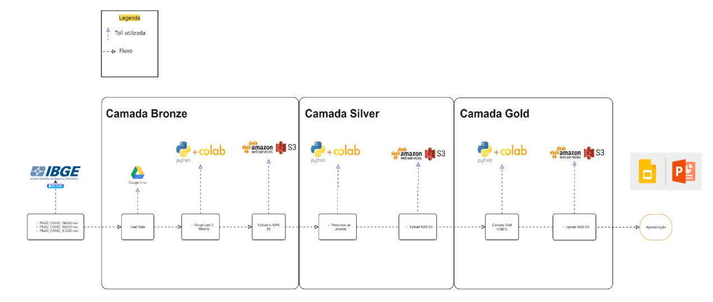

# fiap-tech3-2025
Repositório para entrega do tech challenge fase 3 fiap pos-tech - 9DTAT

## Descrição do Projeto:

Este repositório contém um script para processamento de bases de dados da **PNAD COVID-19**, pesquisa realizada pelo IBGE durante a pandemia. O objetivo é transformar os dados brutos em tabelas organizadas segundo a arquitetura de dados em camadas medalhão: bronze, silver e gold.

- Bronze (Raw): Coleta e consolidação dos arquivos originais da PNAD COVID-19, realizando o download e a junção dos dados.
- Silver: Limpeza, padronização, tratamento de valores nulos e recodificação das variáveis relevantes para análise epidemiológica e sociodemográfica.
- Gold: Geração de tabelas analíticas, agregações, cruzamentos e visualizações para apoiar estudos sobre sintomas, hospitalizações, acesso à saúde e impacto da COVID-19 na população brasileira.

O script automatiza todo o fluxo, desde a obtenção dos dados até a produção de relatórios e gráficos, facilitando o planejamento e a tomada de decisão baseada em evidências durante a pandemia.

## Desenho da solução

